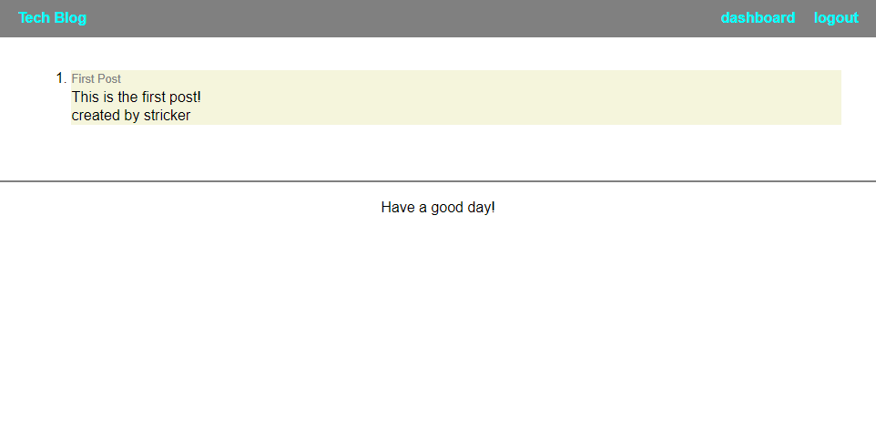

# Tech Blog

## Description
A blog site dedicated to all things tech! Or at least all the things that the user wishes to write about. While not logged in, the user can only see posts that have been created. However, once signed up/logged in the user can also create their own posts to add to the blog feed. 

Project was created using Handlebars HTML, CSS, JavaScript, Node.js, Express.js, MySQL, and Sequelize.

## Steps Taken
* Install all packages needed and create basic file distribution

* Create database, models and seeds to prefill data

* Write routes and test them to ensure GET and POST routes worked properly.

* Build JavaScript form handlers for different actions to work on the site, such as login and logout.

* As different components come together on the back-end, work to build a front-end on which these will be functioning and style as desired.

* Deploy to heroku with the aid of MySQL.

## Webpage

Link: https://safe-shelf-92827.herokuapp.com/

Screenshot:

## Contributors
This application was created by Andrew Secore